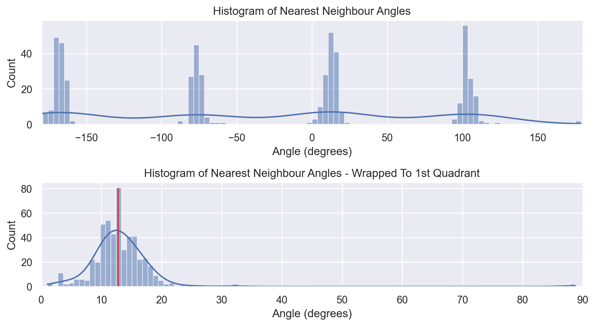
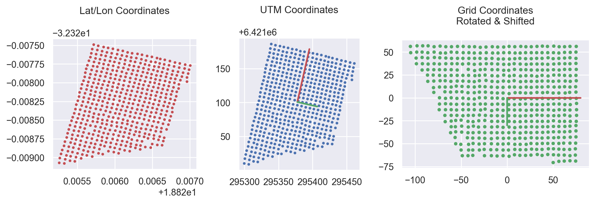
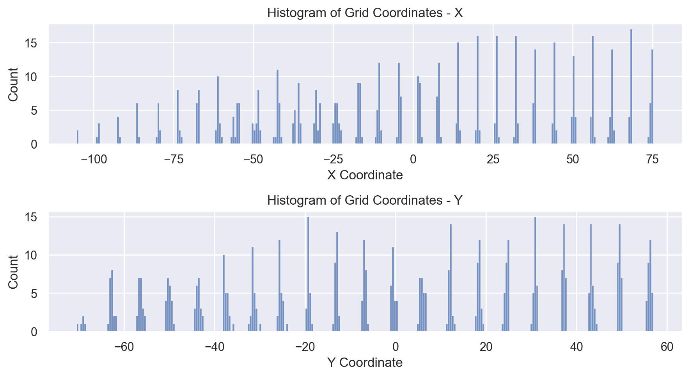
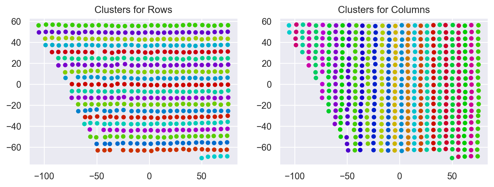
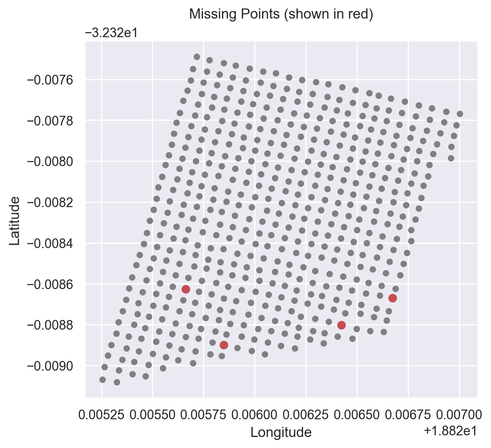

# Gap Map
# 1. Overview
Gap Map helps you map out the gaps in your orchard. The high-level goal of the project is to help farmers identify missing trees in their orchards, providing them with the location of the missing trees so that they can replant them.

In other words, given the existing tree locations (in blue) below, we want to determine the missing tree locations (in black):


To this end, I provide an API which allows you to request a list of missing tree coordinates given the orchard's ID.

**Example GET request:**
```
https://liamjamesclark.com/orchards/{orchard_id}/missing-trees
```

**Example JSON response:**

```js
{"missing_trees": [ {"lat": -33.33, "lng": 18.88}, {"lat": -33.34, "lng": 18.89} ]}
```

# 2. Implementation

## Approach to Finding Missing Trees
1. **Coordinate transformation** from (lat, lon) to UTM coordinates so that we can work in a metric space instead of a projective space.

2. **Nearest Neighbours Analysis:** I perform a nearest neighbours lookup for each tree location to determine the four primary directions for neighbouring trees. These should align to the directions of rows and cols. I take the modulus of the angle ($ang\mod{\frac{\pi}{4}}$) so that all angles are mapped into the first quadrant. The median of these angles is calculated and used as our "grid angle".



3. **Grid Alignment:** The grid is rotated about the mean of the coordinates such that I rotate negative "grid angle" degrees to align the "grid angle" vector with the x-axis. Points in this aligned grid are called the "grid points".



4. **Row & Column Clustering using DBSCAN:** I then perform clustering using DBSCAN on the x and y coordinates independently to identify row and column clusters for the grid points. The parameters for DBSCAN are a minimum of 2 core points, and the epsilon radius is set to be less than the minimum nearest neighbour distance (I use half the min nearest neighbour distance) so that I avoid clustering adjacent rows and columns.




5. **Occupancy Map:** Now that each tree has been clustered into a specific row and column, I arrange these rows and column clusters into an ascending order. This allows us to map the trees spatially into a 2D array representing an occupancy map. In the 2D array, I use a 1 to denote a cell in which a tree exists and a 0 to denote an empty space.

6. **Determining Missing Trees:** To find the missing trees, we need to determine the locations where trees are missing in the occupancy grid. There are locations where it is valid to have empty cells in the occupancy grid, such as around the border of the orchard when the orchard is not perfectly rectangular, so we cannot simply fill in the whole grid. 
My approach to finding the missing trees involves filling the occupancy grid such that we have a grid where all missing trees are filled in. I then subtract this from the original occupancy grid, leaving the cells where trees are missing.

    6a. **Flood filling:** The first step involves determining the cells outside the orchard. I then flood-fill the area surrounding the orchard by padding the original occupancy grid with 0s on all sides and then start flood-filling the outer region of the orchard with values of -1 (representing boundary cells). I then set all the cells that are not boundary cells to 1 (representing trees). This fills both individual missing trees and sections where several trees may be missing in the orchard.

    6b. **Morphological convolutions:** The second step aims to clean up the edges of the orchard where trees may be missing along the boundary, which would have been missed using the flood-filling operation. I aim to fill in the cells in the occupancy grid where three or more adjacent cells in the vertical or horizontal direction contain trees. To do this, I define a kernel $k$, which I convolve with the occupancy grid. Any cell containing a value of 3 or more in the resulting array from the convolution is set to 1 in the occupancy grid. I iteratively perform the convolution operation and update the occupancy grid to fill it in until there is no change to the occupancy grid (at which point applying the operation is idempotent). 
    The kernel is defined below:
    $$
    k = \begin{bmatrix}
    0 & 1 & 0\\
    1 & 0 & 1\\
    0 & 1 & 0
    \end{bmatrix}
    $$

7. **Calculating missing tree positions:** After calculating the (row, col) position of the missing trees in the occupancy grid, I locate all neighboring points for each missing point and compute the median grid point coordinate values of the coordinates of the neighbours, which I then use as the coordinates for the missing point. I then convert these back to latitude and longitude.



## The Orchard Python Module

The functionality for finding missing trees has been wrapped into my orchard module's Grid class (defined in grid.py). The class constructor uses a set of latitude and longitude coordinates to construct the grid for the orchard. From this grid, we can perform operations like finding missing trees; however, the class could very easily be expanded to include other spatial statistics on the orchard, such as the variance in separation distance between neighbouring trees - which may be helpful to know if you are targeting a specific planting density. 

I have extensively used docstrings and types in the module so that it is easy to work with as a dependency (and so that it "plays nice" with IDEs). I have also added comments where I thought explaining what was going on was necessary.

Tests are contained in the grid_test.py file and were implemented using unittest. Unit tests can be run using the command below from the project root directory:
```bash
python -m unittest -v
```

This should yield the following output:

```
test_detect_missing (orchard.test_grid.TestGrid.test_detect_missing) ... ok
test_grid_angle (orchard.test_grid.TestGrid.test_grid_angle) ... ok
test_grid_points (orchard.test_grid.TestGrid.test_grid_points) ... ok
test_grid_row_col (orchard.test_grid.TestGrid.test_grid_row_col) ... ok
test_nearest_neighbour (orchard.test_grid.TestGrid.test_nearest_neighbour) ... ok
test_utm_conversion (orchard.test_grid.TestGrid.test_utm_conversion) ... ok

----------------------------------------------------------------------
Ran 6 tests in 0.008s

OK
```

## The API

The API is implemented using Flask. The application and the single route handler are defined in app.py. The app uses an API token, defined in the AEROBOTICS_API_TOKEN environment variable to interact with the Aerobotics API. The other environment variable that can be set is the AEROBOTICS_BASE_URL, which points to a domain for the API from which to fetch data - this was done to be able to use a mock API for testing if needed. If AEROBOTICS_BASE_URL is not set, the base URL defaults to https://sherlock.aerobotics.com/developers.

Functions for handling the calls to the Aerobotics API and performing validation are found in their own `aerobotics` module.

The process of handling a request to the endpoint `/orchards/{orchard_id}/missing-trees` is as follows:

1. Fetch the data on the orchard from Aerobotics' TreeSurvey endpoint.
2. Parse and validate the data.
3. Compute the missing trees.
4. Construct JSON response and send response.
5. If errors occur, they are handled gracefully, and any errors are returned to the user, denoting what the problems were.
6. Logging has been implemented to capture errors.

Note:
One thing I hesitated to implement without further detail was the pagination when fetching data. I have yet to implement this as I wanted to test this on the data exposed by the API. For instance, do we have multiple instances of the same tree at different points in time? We could see if trees from previous surveys are missing in the latest survey (using a historical lookup). Do orchards change their shape between surveys, perhaps because of growth or new plants being planted in roughly the same location? Another caveat may be that the orchard polygon changes over time, and we need to adjust for that (although I don't currently cull trees from the orchard using this polygon). For these reasons, I specifically limited the scope to the example orchard provided. I did try
have a look to see if I could access other orchards, but I see that I only have access to one orchard via the API.


# 3. Running with Docker

I have provided a Dockerfile for bundling the app and running it using gunicorn with a single worker.

You can build the Docker image by running the command below from the root project directory:
```bash
docker build -t gapmap .
```

I like to use an environment file to manage the environment variables. As an example, let's create the file production.env in our root directory and insert the following (adding your API token):
```
AEROBOTICS_BASE_URL=https://sherlock.aerobotics.com/developers
AEROBOTICS_API_TOKEN=<YOUR TOKEN HERE>
```


You can then run a container which exposes the app on port 8000 using:
```bash
docker run -d --env-file production.env -p 8000:8000 gapmap
```

Finally, to simplify things, I have defined a docker-compose.yml file, which will automatically provision the container per the above docker command.

Additionally, I have added Caddy as a dependent service for Gap Map, to be used as a reverse proxy that auto-provisions TLS certificates for your domain and allows you to access the service on the standard HTTP ports with auto-redirecting from HTTP to HTTPS.

You will need to modify the domain name in the Caddyfile so that it uses your actual domain for provisioning TLS certificates.

You can then run the following command to start everything up automagically:

```bash
docker compose up -d
```

# 4. Future Work

For scenarios where the rows and columns of an orchard curve, it would be interesting to explore adapting the DBSCAN clustering to work not only on a single coordinate but rather compress (but not collapse like I am currently doing) one of the axes to cluster the rows, and vice versa to cluster columns. This would allow one to cluster while accounting for changes to the one axes relative to the other.

For scenarios where the distance between rows and columns varies throughout the orchard, I saw an interesting approach that makes use of a "Parallel Slopes Ordinary Least Squares (OLS) Model", which may be worth looking into further:
https://stackoverflow.com/questions/62946604/fitting-an-orthogonal-grid-to-noisy-coordinates/72854265#72854265

I initially approached the problem by trying to find grid lines using the [Hough Transform](https://en.wikipedia.org/wiki/Hough_transform), which had several issues, including detecting grid lines along the diagonals. I suspect one could get this approach to work with some additional filtering.